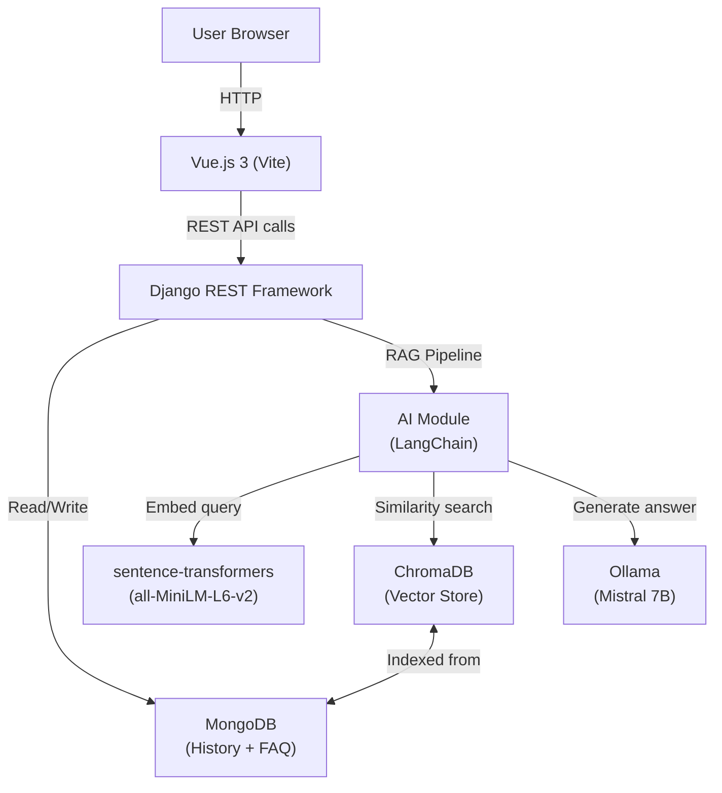
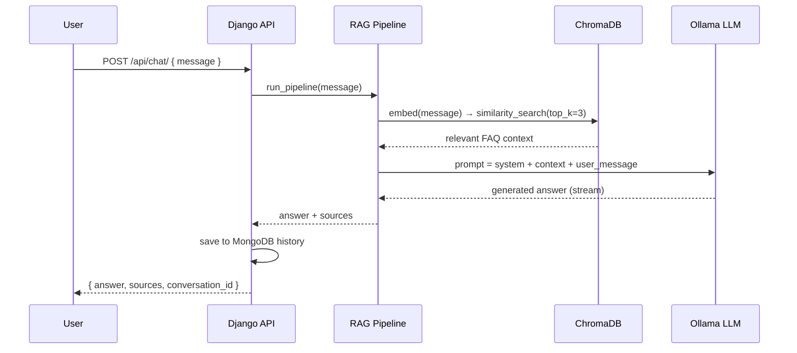

# AI Customer Support Chatbot — Full-Stack Self-Learning Project

## Architecture Overview




## Tech Stack

- **Frontend**: Vue.js 3 (Composition API) + Vite + Pinia (state) + Tailwind CSS
- **Backend**: Python 3.11 + Django 5 + Django REST Framework
- **AI Pipeline**: LangChain + sentence-transformers + ChromaDB + Ollama (Mistral 7B)
- **Database**: MongoDB via MongoEngine ODM
- **Orchestration**: Docker Compose (MongoDB + backend + frontend)

## Project Structure

```
AI-Assistance/
├── frontend/             # Vue.js 3 app
│   ├── src/
│   │   ├── components/   # ChatWindow, MessageBubble, FAQPanel
│   │   ├── stores/       # Pinia chat store
│   │   └── views/        # HomeView
│   └── package.json
├── backend/              # Django project
│   ├── chatbot/          # Main Django app
│   │   ├── models.py     # Conversation, Message, FAQ (MongoEngine)
│   │   ├── views.py      # API endpoints
│   │   ├── serializers.py
│   │   └── ai_pipeline.py  # RAG logic
│   ├── requirements.txt
│   └── manage.py
├── docker-compose.yml
└── README.md
```

## AI Pipeline (RAG — Retrieval Augmented Generation)




## REST API Endpoints

- `POST /api/chat/` — send message, get AI answer
- `GET /api/conversations/` — list all conversations
- `GET /api/conversations/{id}/` — fetch full conversation history
- `POST /api/faq/` — create FAQ entry (admin seeding)
- `GET /api/faq/` — list FAQ entries
